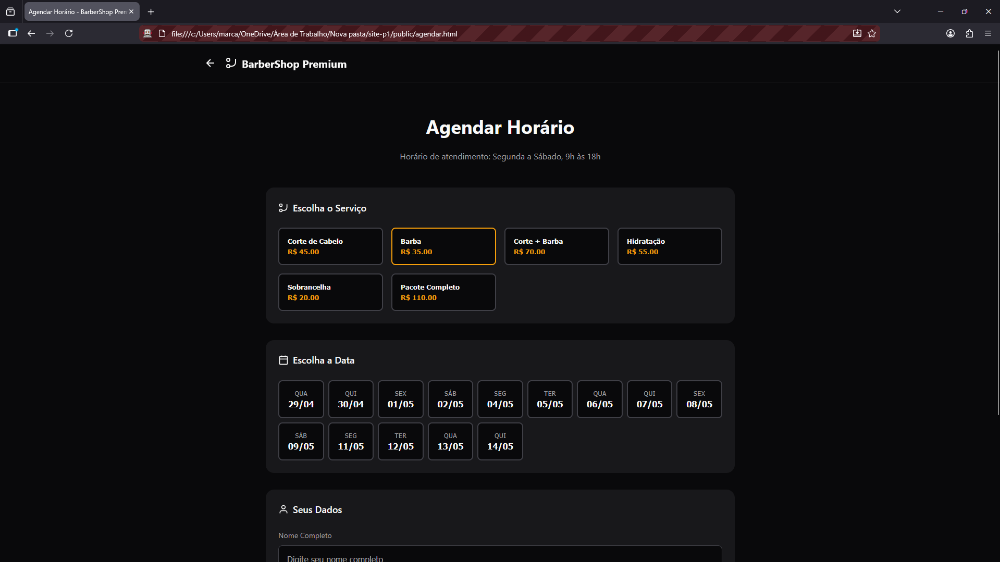
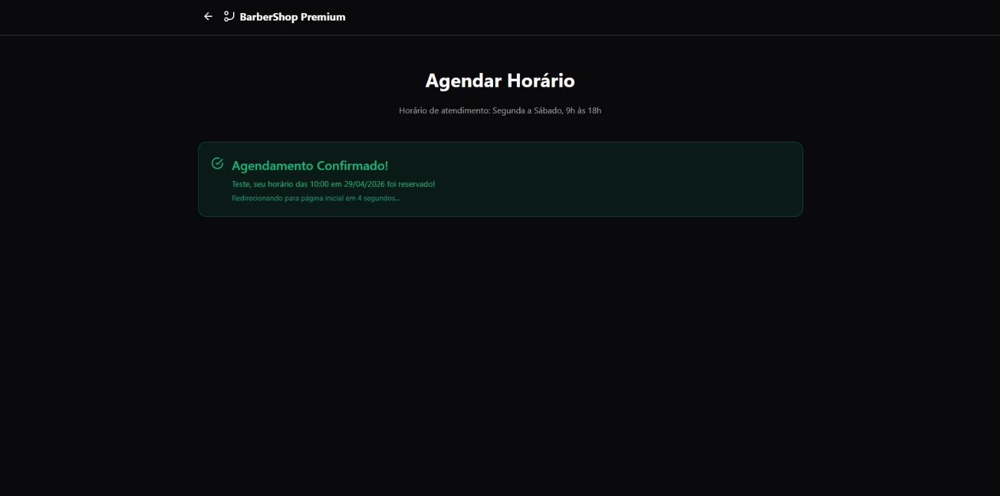

# ✂️ BarberShop Premium

Site institucional com sistema de agendamento online para barbearia — permite que clientes escolham serviço, data e horário diretamente pelo navegador.

---

## 🖥️ Demonstração

### Página Inicial


### Agendamento


### Confirmação de Horário


---

## 🔗 Acesso em Produção

**➡️ [https://m4rcos-antonio.github.io/site-p1](https://m4rcos-antonio.github.io/site-p1)**  

---

## 🛠️ Tecnologias Utilizadas

| Tecnologia | Finalidade |
|------------|------------|
| HTML5 | Estrutura das páginas |
| CSS3 | Estilização e layout responsivo |
| JavaScript (Vanilla) | Lógica de agendamento e interatividade |
| MySQL | Banco de dados para agendamentos e serviços |
| SQL (`database.sql`) | Script de criação das tabelas e dados iniciais |

---

## ⚙️ Como clonar e rodar localmente

### Pré-requisitos

- Navegador moderno (Chrome, Firefox, Edge)
- [XAMPP](https://www.apachefriends.org/) ou similar (Apache + PHP + MySQL)
- Servidor local (ex: [Live Server](https://marketplace.visualstudio.com/items?itemName=ritwickdey.LiveServer) no VS Code)

### Passo a passo

```bash
# 1. Clone o repositório
git clone https://github.com/m4rcos-antonio/site-p1.git

# 2. Acesse a pasta do projeto
cd site-p1
```

**3. Importe o banco de dados no phpMyAdmin:**

- Inicie o XAMPP e ative os módulos **Apache** e **MySQL**
- Acesse `http://localhost/phpmyadmin`
- Crie um novo banco chamado `barbearia_db`
- Clique em **Importar**, selecione o arquivo `database.sql` e confirme

**4. Abra o projeto no navegador:**

- Abra o arquivo `public/index.html` com a extensão **Live Server** no VS Code (clique em "Go Live")  
- Ou coloque a pasta do projeto dentro de `htdocs/` do XAMPP e acesse `http://localhost/site-p1/public/`

---

## 📄 Páginas

- **`index.html`** — Página principal com serviços, sobre e contato
- **`agendar.html`** — Formulário de agendamento (escolha serviço, data e horário)

---

## 💈 Funcionalidades

- Listagem dinâmica de serviços com preços
- Seleção de data e horário disponíveis
- Bloqueio automático de horários já reservados
- Formulário de agendamento com validação
- Layout responsivo para mobile e desktop

---

## 👨‍💻 Autores

| Nome | GitHub |
|------|--------|
| Marcos Antonio | [@m4rcos-antonio](https://github.com/m4rcos-antonio) |
| Mateus Hossaka | [@matthofe](https://github.com/matthofe) |

---

## 📝 Licença

Este projeto foi desenvolvido para fins acadêmicos.
